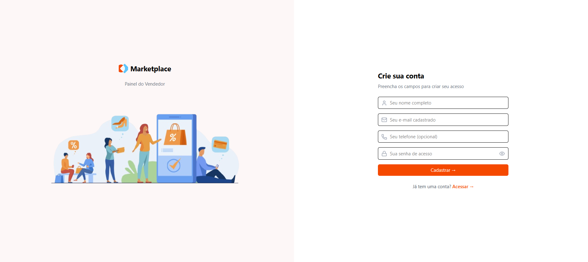
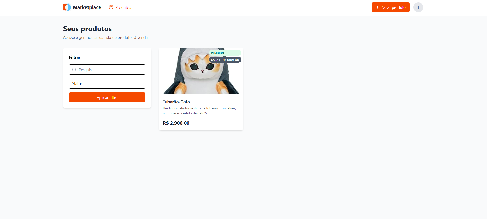
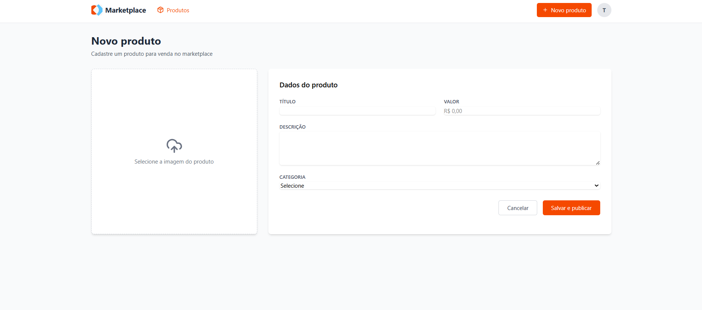
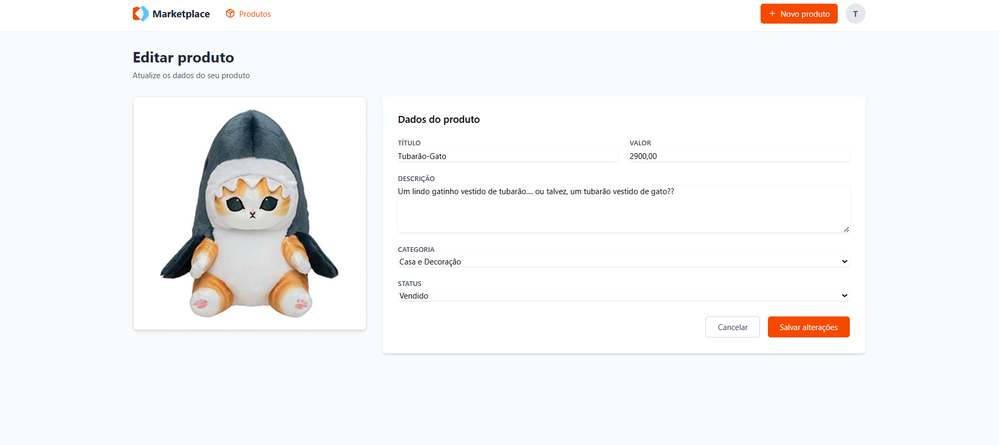

# Painel de Vendedor - Marketplace 🛍️
Este projeto foi desenvolvido como parte de um processo seletivo, simulando o painel de controle de um vendedor em um marketplace. A aplicação permite que usuários se cadastrem, façam login e gerenciem seus produtos (cadastro, visualização, edição, exclusão e filtragem).

## ✨ Funcionalidades
* Autenticação de Usuários: Sistema completo de Cadastro e Login com persistência de sessão via JWT.

* Dashboard de Produtos: Visualização de todos os produtos do vendedor em um layout de grade.

* CRUD de Produtos: Funcionalidade completa para Criar, Ler, Atualizar e Excluir produtos.

* Upload de Imagens: Suporte para upload de imagem no cadastro e na edição de produtos.

* Filtros Dinâmicos: Permite filtrar a lista de produtos por nome (texto) e por status (ativo, inativo, vendido).

* Interface Reativa: Frontend construído em React com uma experiência de usuário fluida e moderna, utilizando Tailwind CSS para estilização.

## 🚀 Tecnologias Utilizadas
O projeto é dividido em duas partes principais:

Frontend:

* React (com Vite): Biblioteca para construção da interface de usuário.

* React Router DOM: Para gerenciamento de rotas.

* Tailwind CSS: Framework de estilização utility-first.

* Axios: Cliente HTTP para comunicação com a API.

* Lucide React: Biblioteca de ícones.

Backend:

* Node.js: Ambiente de execução do servidor.

* Express.js: Framework para construção da API REST.

* PostgreSQL: Banco de dados relacional para armazenamento dos dados.

* JWT (JSON Web Token): Para gerenciamento de sessões e autenticação.

* Bcrypt.js: Para criptografia de senhas.

* Multer: Middleware para manipulação de uploads de arquivos.

Ambiente:

* Docker: Para rodar o banco de dados PostgreSQL em um container isolado, garantindo a consistência do ambiente.

## 📋 Pré-requisitos
Antes de começar, você precisará ter as seguintes ferramentas instaladas em sua máquina:

* Node.js (v18 ou superior)

* npm ou Yarn

* Docker
